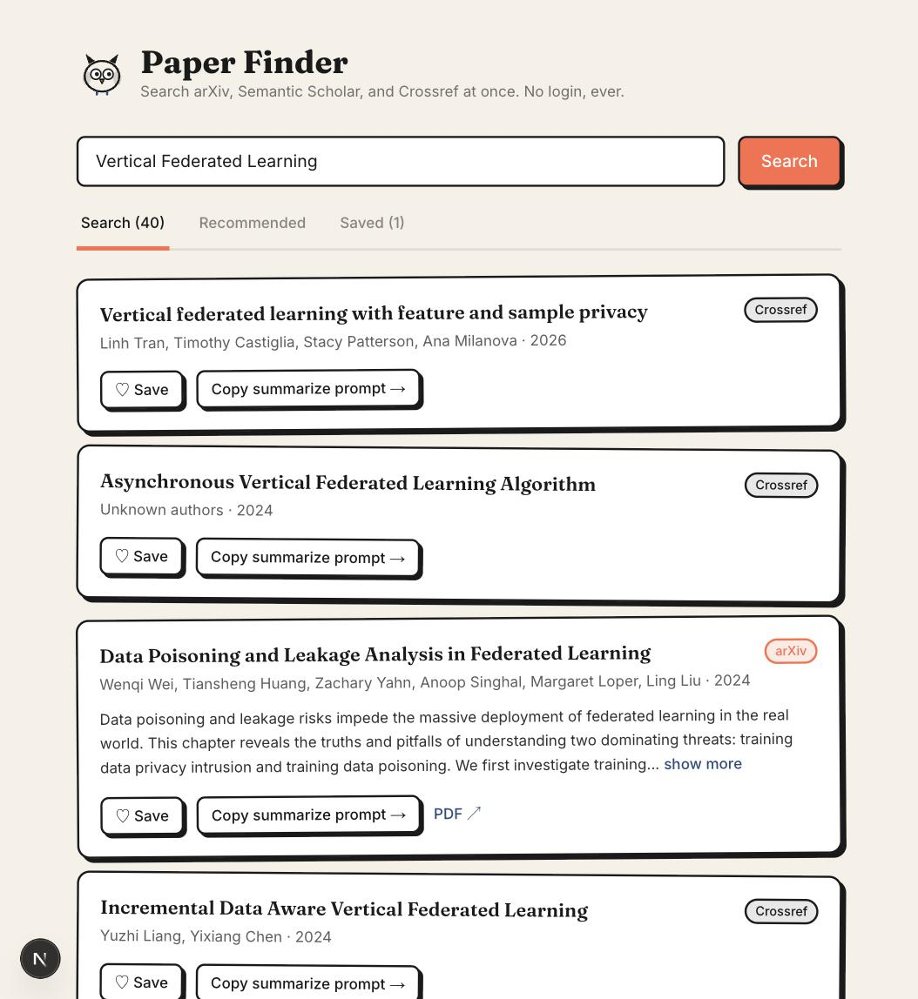

# Paper Finder

A free, no-login research paper discovery tool. Search arXiv, Semantic Scholar, and Crossref at once, save what you like, and get a ready-made prompt to have any LLM summarize a paper for you.

**Live:** https://paper-finder-five.vercel.app



## Why this exists

Most AI-powered research tools (Elicit, Consensus, SciSpace, ...) require an account and cap usage on a free tier before pushing you to a paid plan. Paper Finder never asks for an account and never hits a usage limit, because it doesn't call an LLM API itself - summarization is "bring your own": copy a pre-built prompt and paste it into whichever LLM you already use.

## Features

- **Multi-source search** - queries arXiv, Semantic Scholar, and Crossref in parallel, merges the results, and deduplicates papers indexed by more than one source (matching on DOI, arXiv ID, or normalized title).
- **Semantic relevance ranking** - a small sentence-embedding model runs entirely in your browser (no server round-trip) and re-ranks results by actual relevance to your query, not just publication year.
- **Save without an account** - saved papers live in your browser's `localStorage`. No signup, no server-side database, nothing to leak.
- **Recommendations** - a "Recommended" tab surfaces new papers similar to the ones you've saved, via Semantic Scholar's Recommendations API.
- **Copy a summarize prompt** - one click copies a prompt (title, authors, abstract, link, and instructions) to your clipboard, ready to paste into Claude, ChatGPT, Gemini, or anything else.
- **Graceful degradation** - if one upstream API is slow or down, the other two still return results; a banner only appears for a genuine outage, not routine rate limiting.

## Tech stack

Next.js (App Router, TypeScript) on Vercel. No database, no auth provider, no server-side LLM calls. Tailwind v4 for styling, `next/font/google` for fonts, `fast-xml-parser` for arXiv's Atom feed, and a client-side embedding model (via transformers.js) for semantic ranking.

## Architecture

```
/api/search    -> fans out to arXiv + Semantic Scholar + Crossref (Promise.allSettled,
                   per-source timeout) -> normalize each into a shared Paper shape
                   -> dedup/merge -> sorted results
/api/recommendations -> forwards saved-paper IDs to Semantic Scholar's
                   Recommendations API -> normalized Paper[]
client          -> localStorage-backed saved papers, copy-to-clipboard prompt
                   builder, and an in-browser embedding model that re-ranks
                   results by semantic similarity to the query
```

See `src/lib/papers/` for the per-source adapters and merge logic, and `src/lib/embeddings/` for the client-side re-ranker.

## Local setup

```bash
git clone https://github.com/emmanuel-adu/paper-finder.git
cd paper-finder
npm install
cp .env.example .env.local   # fill in CROSSREF_MAILTO at minimum
npm run dev
```

Open http://localhost:3000.

### Environment variables

| Variable | Required | Notes |
|---|---|---|
| `CROSSREF_MAILTO` | Yes | Your email, sent to Crossref's API to opt into their faster "polite pool." Not a secret, just identifies the requester. |
| `SEMANTIC_SCHOLAR_API_KEY` | No | Optional. The unauthenticated tier shares a global rate-limit pool and can 429 under load. A free key (request one at https://www.semanticscholar.org/product/api#api-key-form) removes that limit. |

## Contributing

Contributions are welcome - see [CONTRIBUTING.md](CONTRIBUTING.md) for local dev setup and PR guidelines.

## License

[MIT](LICENSE)
